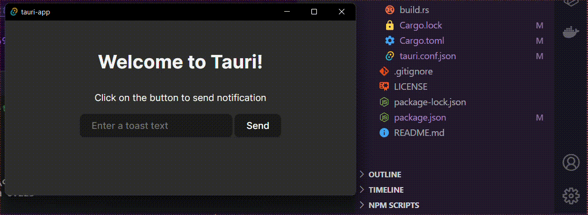

# Trying notifications in tauri
Creating a tauri app that askes user for a text and send that text as notification, Example code

# Preview
    
## Setup
```
npm install
```

## Run on development 
```
npm run tauri dev
```

## Other Requirements
- Rust


